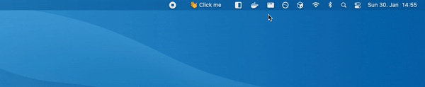

<h1 align="center">
    📰 Billboard
</h1>

<strong>Put text on your Mac status bar</strong>

  
  

This is a little app that allows to put an user-defined text to the status bar of a Mac (the one on top). It is built with Swift and React-Native and
is kind of a PoC that is possible to bind the status bar to an React-Native app. Further improvement ideas are totally welcome!

## 📸 Screenshot

## 💻 Download

[The latest release can be downloaded here](https://github.com/daschaa/billboard/releases). Currently the app is not signed, but it is on the open task list.

## 👯 Contributing

Any contributions are highly welcomed. If you have any ideas, please create an issue before creating an pull-request. Thanks in advance ❤️
